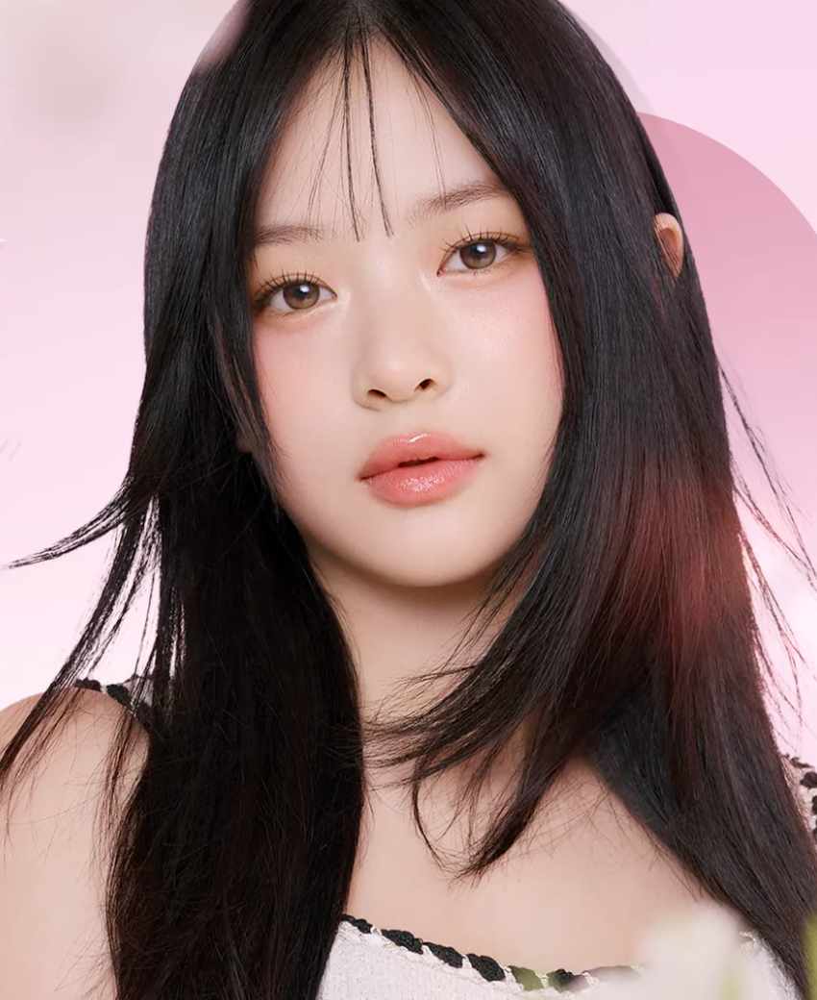

# Anime Style Image Filter

This project transforms images into an anime/cartoon style using OpenCV. It smooths the image while preserving edges to create a cartoon-like effect.

## Algorithm Overview

1. **Bilateral Filtering**: Smooths the image while keeping edges sharp (`d=9`, `sigmaColor=75`, `sigmaSpace=75`).
2. **Grayscale Conversion**: Prepares the image for edge detection.
3. **Canny Edge Detection**: Detects key edges with thresholds `100` and `200`.
4. **Edge Inversion**: Creates a mask where edges are black and non-edges are white.
5. **Mask Application**: Retains smooth non-edge areas from the filtered image.
6. **Blending**: Combines the processed image with the original image (weights: 1 and 0.1).

## Results

### Good Performance
The algorithm performs well on images with:
- Clear subjects and simple backgrounds.
- Sharp edges and moderate color complexity.

**Example**: Portrait photos with uniform lighting and plain backgrounds.

  
  

### Poor Performance
The algorithm struggles with:
- Images with many small details.
- Complex lighting or color gradients.

**Example**: Landscape photos with intricate details like leaves.

## Limitations
- Loss of fine details in non-edge areas due to masking.
- Edges are not emphasized enough in the final output.
- No color quantization, leaving gradients intact.
- Fixed parameters may not suit all image types.
